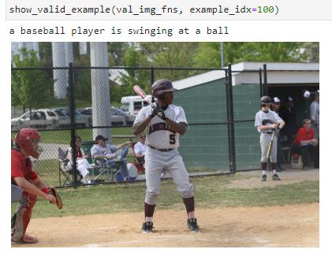

# Image-Captioning


Training using COCO / 2014 dataset


## Getting Started

After uploading to Jupiter notebook, open the'Image Captioning.ipynb' file.

### Installing

This project has the following dependencies:
```
"dependencies": {
numpy,
keras,
tensorflow,
tqdm,
cv2,
pickle
}
```
## Example




## Authors

* **ChanHoCho93** - [Github](https://github.com/ChanHoCho93)